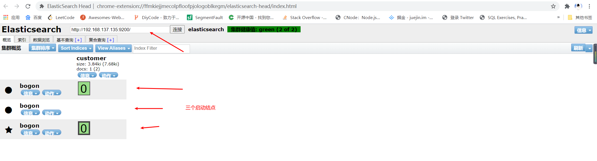

# ElasticSearch doc and common-write（ElasticSearch doc文档摘要）

## 一、ElasticSearch入门
### 1.获取安装并且启动ElasticSearch（Get ElasticSearch up and running）
```text
以linux系统安装为例：
    1.下载ElasticSearch
        linux: https://artifacts.elastic.co/downloads/elasticsearch/elasticsearch-7.10.1-linux-x86_64.tar.gz
    2.解压ElasticSearch
        linux: tar -xvf elasticsearch-7.10.1-linux-x86_64.tar.gz
    3.放置到 / 目录下，进入elasticsearch/bin目录中，并且执行命令: ./elasticsearch
    4.启动elasticsearch 集群结点: ./elasticsearch -Epath.data=data2 -Epath.logs=log2  (9201端口)---启动两个
                            ./elasticsearch -Epath.data=data3 -Epath.logs=log3      (9202端口)---启动三个
    5.安装elasticsearch-head: 直接到google网上应用插件，搜索elasticsearch就能出来。安装成功后打开会默认连接9200端口结点。
```

### 2.索引数据
```text
    说明: ElasticSearch的index对应MySQL的table，document对用MySQL的一条数据，其中document数据是json的格式。
```
```text
    你可以将json通过PUT请求的方式，创建索引(index)表或向索引(index)表中添加数据。
    PUT /customer/_doc/1
    {
      "name": "John Doe"
    }
    你将得到一个JSON形式的结果
    {
      "_index" : "customer", //索引名称
      "_type" : "_doc",      //类型
      "_id" : "1",           //id
      "_version" : 1,        //修改的版本，每修改一次+1
      "result" : "created",  //动作 updated 或者 created  或者 deleted
      "_shards" : {          
        "total" : 2,
        "successful" : 2,
        "failed" : 0
      },
      "_seq_no" : 26,
      "_primary_term" : 4
    }
```
```text
    你还可以使用GET请求的方式，按照 "index(索引名)/_doc/id"，的方式查询你添加的数据
    GET /customer/_doc/1
    结果：
    {
      "_index" : "customer",
      "_type" : "_doc",
      "_id" : "1",
      "_version" : 1,
      "_seq_no" : 26,
      "_primary_term" : 4,
      "found" : true,
      "_source" : {
        "name": "John Doe"
      }
    }
```
```text
    当document数据比较多的时候，es还为我们提供了bulk api的方式批量执行添加数据。
```
```text
    使用es官方文档提供的json文件，accounts.json
    执行：curl -H "Content-Type: application/json" -XPOST "192.168.137.135:9200/bank/_bulk?pretty&refresh" --data-binary "@accounts.json"
    查询索引：curl 192.168.137.135:9200/_cat/indices?v
    health status index    uuid                   pri rep docs.count docs.deleted store.size pri.store.size
    green  open   bank     UwDzzS2QRTWomxBq6wLqdQ   1   1       1000            0      787kb        394.9kb
    green  open   customer 7CL7iL6pRwqbVFihV2nGCw   1   1          1            0      7.6kb          3.8kb
```
### 3.开始查询（start searching）
```text
    当你导入完成bank索引的数据后，你可以使用如下方式的，json检索bank索引库的所有数据。
    GET /bank/_search
    {
      "query": { "match_all": {} },
      "sort": [
        { "account_number": "asc" }
      ]
    }
    在返回的标签中hit展示了数据，默认返回前10条数据。
    {
      "took" : 63,
      "timed_out" : false,
      "_shards" : {
        "total" : 5,
        "successful" : 5,
        "skipped" : 0,
        "failed" : 0
      },
      "hits" : {
        "total" : {
            "value": 1000,
            "relation": "eq"
        },
        "max_score" : null,
        "hits" : [ {
          "_index" : "bank",
          "_type" : "_doc",
          "_id" : "0",
          "sort": [0],
          "_score" : null,
          "_source" : {"account_number":0,"balance":16623,"firstname":"Bradshaw","lastname":"Mckenzie","age":29,"gender":"F","address":"244 Columbus Place","employer":"Euron","email":"bradshawmckenzie@euron.com","city":"Hobucken","state":"CO"}
        }, {
          "_index" : "bank",
          "_type" : "_doc",
          "_id" : "1",
          "sort": [1],
          "_score" : null,
          "_source" : {"account_number":1,"balance":39225,"firstname":"Amber","lastname":"Duke","age":32,"gender":"M","address":"880 Holmes Lane","employer":"Pyrami","email":"amberduke@pyrami.com","city":"Brogan","state":"IL"}
        }, ...
        ]
      }
    }
```
```text
返回信息解析
    took: ElasticSearch运行查询使用了多长时间。
    timed_out: 是否超时。
    _shards: 分片，total-分片总数，successful-成功查询了多少分片，skipped-跳过了多少个分片，failed-失败了多少个分片。
    max_source: 找到相关文件的分数。
    hits.total.value: 找到匹配数据数量。
    hits.sort: 文档的排序位置（不按相关性得分排序时）
    hits._score: 文档的相关得分。（不适用与match_all）
```
```text
    任何一个搜索请求都是独立的，ElasticSearch不会维持任何一个请求。请在搜索中指定from和size。（分页参数）
    {
      "query": { "match_all": {} },
      "sort": [
        { "account_number": "asc" }
      ],
      "from": 10,
      "size": 10
    }
```
```text
    可以使用如下json查询address中包含mill 或者 lane单词的数据，相当于sql中的like全匹配。(空格表示分隔单词)
    GET /bank/_search
    {
      "query": { "match": { "address": "mill lane" } }
    }
```
```text
    如果你不想分单词搜索，而是想匹配输入的所有单词的组合str，你可以使用match_phrase，如下搜索json
    GET /bank/_search
    {
      "query": { "match_phrase": { "address": "mill lane" } }
    }
```
```text
    如果你需要构建更复杂的查询，你可以使用bool去组合多个查询条件。你可以使用必须匹配(must match)，应该匹配（should match），不应该匹配（must not match）
等的查询条件。
    GET /bank/_search
    request body:[
    {
        "from": 0,
        "size": 2,
        "query": {
            "bool": {
                "must": [
                    {
                        "match": {
                            "age": "40"
                        }
                    }
                ],
                "must_not": [
                    {
                        "match": {
                            "state": "ID"
                        }
                    }
                ]
            }
        }
    }

    {
      "query": {
        "bool": {
          "must": { "match_all": {} },
          "filter": {
            "range": {
              "balance": {
                "gte": 20000,
                "lte": 30000
              }
            }
          }
        }
      }
    }
    ]
    其中must_not被视为过滤器和range一样，他们不会影响score的分数，must与should这样的才会影响score分数的判定。返回的结果中score分数越高的越满足我们的搜
索条件。
    response body:
    {
        "took": 12,
        "timed_out": false,
        "_shards": {
            "total": 1,
            "successful": 1,
            "skipped": 0,
            "failed": 0
        },
        "hits": {
            "total": {
                "value": 43,
                "relation": "eq"
            },
            "max_score": 1.0,
            "hits": [
                {
                    "_index": "bank",
                    "_type": "_doc",
                    "_id": "474",
                    "_score": 1.0,
                    "_source": {
                        "account_number": 474,
                        "balance": 35896,
                        "firstname": "Obrien",
                        "lastname": "Walton",
                        "age": 40,
                        "gender": "F",
                        "address": "192 Ide Court",
                        "employer": "Suremax",
                        "email": "obrienwalton@suremax.com",
                        "city": "Crucible",
                        "state": "UT"
                    }
                },
                {
                    "_index": "bank",
                    "_type": "_doc",
                    "_id": "479",
                    "_score": 1.0,
                    "_source": {
                        "account_number": 479,
                        "balance": 31865,
                        "firstname": "Cameron",
                        "lastname": "Ross",
                        "age": 40,
                        "gender": "M",
                        "address": "904 Bouck Court",
                        "employer": "Telpod",
                        "email": "cameronross@telpod.com",
                        "city": "Nord",
                        "state": "MO"
                    }
                }
            ]
        }
    }
```
### 4.使用汇总分析结果（Analyze results with aggregations）（聚合汇总分析数据）
```text
    你可以使用ES对数据进行聚合查询操作，如下json执行aggs，你可以对账户状态(state)字段进行分组统计查询，以group_by_state为组名，并默认以降序的方式列出
前十条统计数据结果。
    request boy:
    {
      "size": 0,
      "aggs": {
        "group_by_state": {
          "terms": {
            "field": "state.keyword"
          }
        }
      }
    }
```
```text
    你可以得到如下以结果：
    response body:
    {
        "took": 87,
        "timed_out": false,
        "_shards": {
            "total": 1,
            "successful": 1,
            "skipped": 0,
            "failed": 0
        },
        "hits": {
            "total": {
                "value": 1000,
                "relation": "eq"
            },
            "max_score": null,
            "hits": []
        },
        "aggregations": {
            "group_by_state": {
                "doc_count_error_upper_bound": 0,
                "sum_other_doc_count": 743,
                "buckets": [
                    {
                        "key": "TX",
                        "doc_count": 30
                    },
                    {
                        "key": "MD",
                        "doc_count": 28
                    },
                    {
                        "key": "ID",
                        "doc_count": 27
                    },
                    {
                        "key": "AL",
                        "doc_count": 25
                    },
                    {
                        "key": "ME",
                        "doc_count": 25
                    },
                    {
                        "key": "TN",
                        "doc_count": 25
                    },
                    {
                        "key": "WY",
                        "doc_count": 25
                    },
                    {
                        "key": "DC",
                        "doc_count": 24
                    },
                    {
                        "key": "MA",
                        "doc_count": 24
                    },
                    {
                        "key": "ND",
                        "doc_count": 24
                    }
                ]
            }
        }
    }
```
```text
    你还可以进行更复杂的聚合操作，你可以更具状态对账户进行分组，并求出分组后的某项数据平均值。
    request body:
    {
      "size": 0,
      "aggs": {
        "group_by_state": {
          "terms": {
            "field": "state.keyword"
          },
          "aggs": {
            "average_balance": {
              "avg": {
                "field": "balance"
              }
            }
          }
        }
      }
    }
```
```text
    response body:
    {
        "took": 133,
        "timed_out": false,
        "_shards": {
            "total": 1,
            "successful": 1,
            "skipped": 0,
            "failed": 0
        },
        "hits": {
            "total": {
                "value": 1000,
                "relation": "eq"
            },
            "max_score": null,
            "hits": []
        },
        "aggregations": {
            "group_by_state": {
                "doc_count_error_upper_bound": 0,
                "sum_other_doc_count": 743,
                "buckets": [
                    {
                        "key": "TX",
                        "doc_count": 30,
                        "average_balance": {
                            "value": 26073.3
                        }
                    },
                    {
                        "key": "MD",
                        "doc_count": 28,
                        "average_balance": {
                            "value": 26161.535714285714
                        }
                    },
                    {
                        "key": "ID",
                        "doc_count": 27,
                        "average_balance": {
                            "value": 24368.777777777777
                        }
                    },
                    {
                        "key": "AL",
                        "doc_count": 25,
                        "average_balance": {
                            "value": 25739.56
                        }
                    },
                    {
                        "key": "ME",
                        "doc_count": 25,
                        "average_balance": {
                            "value": 21663.0
                        }
                    },
                    {
                        "key": "TN",
                        "doc_count": 25,
                        "average_balance": {
                            "value": 28365.4
                        }
                    },
                    {
                        "key": "WY",
                        "doc_count": 25,
                        "average_balance": {
                            "value": 21731.52
                        }
                    },
                    {
                        "key": "DC",
                        "doc_count": 24,
                        "average_balance": {
                            "value": 23180.583333333332
                        }
                    },
                    {
                        "key": "MA",
                        "doc_count": 24,
                        "average_balance": {
                            "value": 29600.333333333332
                        }
                    },
                    {
                        "key": "ND",
                        "doc_count": 24,
                        "average_balance": {
                            "value": 26577.333333333332
                        }
                    }
                ]
            }
        }
    }
```
```text
    对聚合结果进行排序
    request body:
    {
      "size": 0,
      "aggs": {
        "group_by_state": {
          "terms": {
            "field": "state.keyword",
            "order": {
              "average_balance": "desc"
            }
          },
          "aggs": {
            "average_balance": {
              "avg": {
                "field": "balance"
              }
            }
          }
        }
      }
    }
```
```text
    结果略
```
