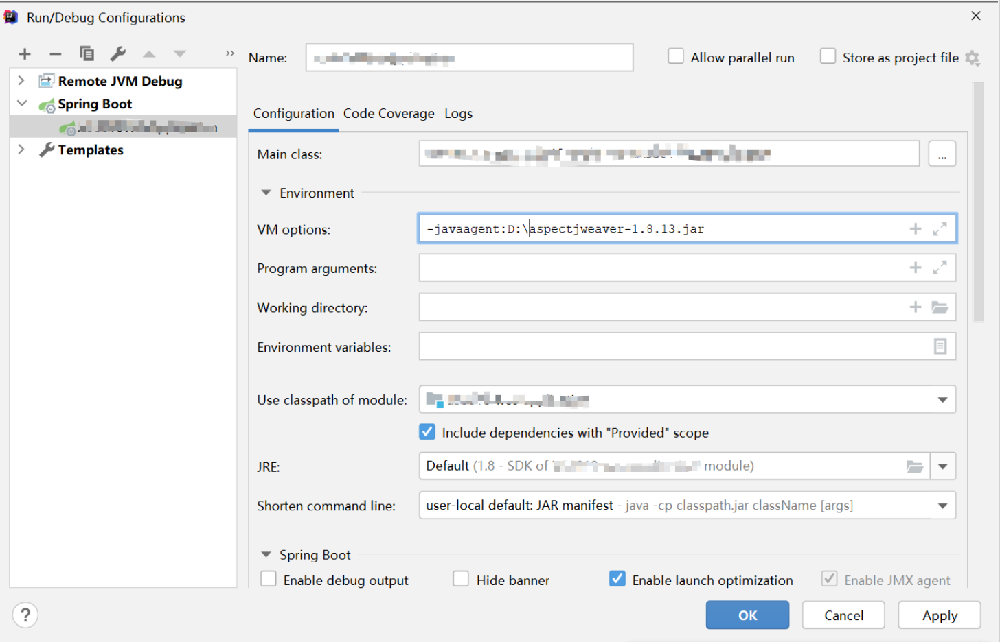
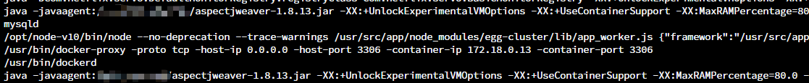
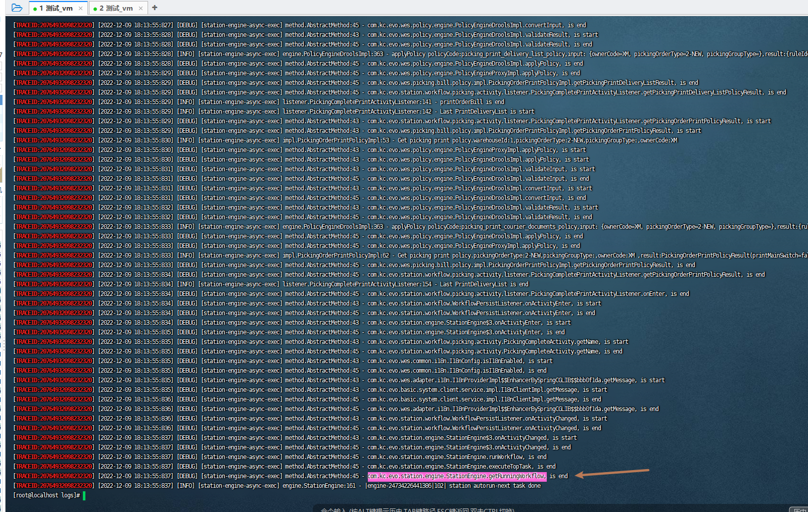

# 原理
```text
    AspectJ使用Java代理来在类加载时织入代码，这种方式称为Load-time weaving（LTW），它是一种在类加载期间动态织入切面的技术。
通过Java代理和AspectJ的weaver，AspectJ可以在目标类加载到内存之前，将切面的逻辑织入到目标类中，实现AOP（面向切面编程）的功能。
```
# 优化
```text
修改成为配置文件的方式，根据需要自由配置
```
# 方法开始结束的日志打印，介绍
```text
    0.生成traceId(采用雪花算法生成的数字串，固定18位)
    1.可以打印方法的出入日志
    2.http请求的入参
    3.feign请求的时候将traceId带入到请求头中，被请求的系统引入此包会复用同一个traceId(格式：serverName_traceId)
```
## 使用
```text
0.修改 AbstractMethod 包名为自己的项目包名
1.mvn clean install -Dmaven.test.skip=true 命令生成jar包
2.在启动参数中添加 -javaagent:aspectjweaver-1.8.13.jar
```


```text
3.项目中添加本依赖
<dependency>
      <groupId>com.zxf</groupId>
      <artifactId>method-trace-log</artifactId>
      <version>${method-trace-log.version}</version>
</dependency>
```
## 项目启动时会自动将代码植入到你的class文件中，植入代码如下样例

## 效果展示

## 支持的维度
### Spring
```text
Spring管理的bean对象，规则如下：
需要包含如下注解:
    @Component
    @Controller
    @RestController
    @Service
    @Repository
```
### Thread: 一般线程实现类
```text
runnable的子类run方法，但是不包含Spring定时任务下的线程类
```
### Spring Schedule: spring的定时任务
```text
包含@Scheduled注解的方法切面
```
### 其他待完善埋点
```text
1. lambda创建的线程traceId的添加
2. 线程池的traceId添加
```
### 使用指南
```text
修改：AbstractMethod
    @Pointcut("execution(* com.zxf..*.*(..))")
    public void mustPointCutMethod(){}

    @Pointcut("!execution(* com.zxf..*.lambda*(..))")
    public void notPointCutLambdaMethod(){}
    
    aop.xml
    <include within="com.zxf..*"/>
```