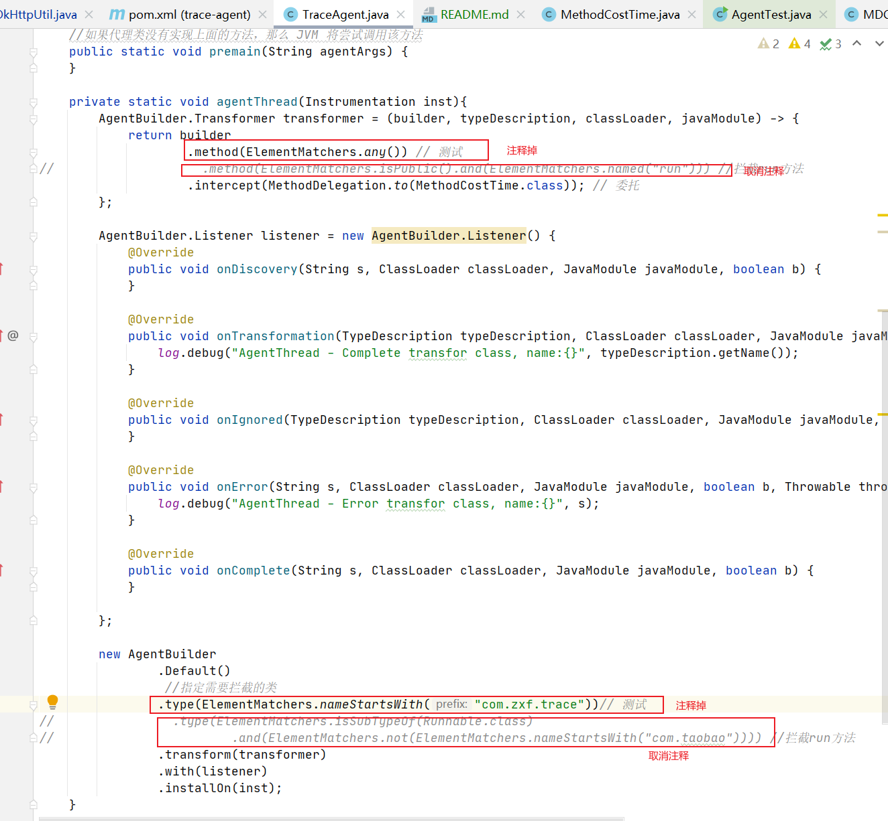

# TraceId 生成agent
```text
    通过MAVEN打包的时候，引入maven-assembly-plugin工具进行打包成jar，自动根据maven的配置信息生成MANIFEST.MF文件
文件指定Premain-Class: com.kc.evo.trace.TraceAgent为运行的类，jvm找到此类中的permain方法去运行，在方法中通过bytebudy
去修改字节码文件达到在run运行时在log4j的MDC中插入日志唯一traceID的目的。
```
```text
    以线程run方法为切入点的，在run方法执行前将TraceId赋予log4j的MDC中。
```
## 如何测试
```text
    使用MAVEN打包生成jar
    启动参数添加:-javaagent:trace-agent-1.0-SNAPSHOT.jar
    直接运行此测试类:com.zxf.trace.AgentTest.main
```
## 如何使用
```text
    将com.zxf.trace.TraceAgent代码调整，如图:
```

```text
    使用MAVEN打包生成jar
    将此jar运用在启动参数上[-javaagent:trace-agent-1.0-SNAPSHOT.jar]
```


```text
1.直接deploy的jar可以直接使用

2.install不能使用，会报错
Java HotSpot(TM) 64-Bit Server VM warning: UseCMSCompactAtFullCollection is deprecated and will likely be removed in a future release.
Failed to find Premain-Class manifest attribute in /opt/evo-station/trace-agent.jar
Error occurred during initialization of VM
agent library failed to init: instrument

3.可以尝试使用package 打包
```